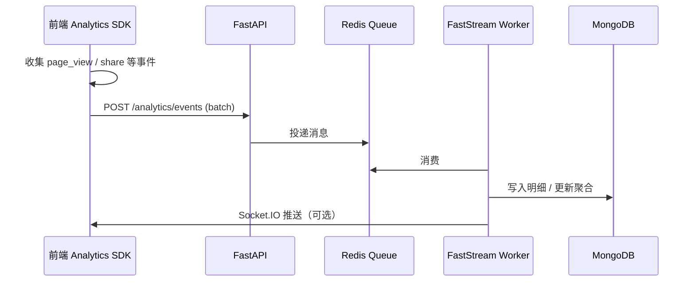

# 分析与异步处理

星汇小蜜书将 **访问分析** 与 **耗时任务** 解耦：前端 SDK 批量上报 → Redis 队列 → FastStream Worker 聚合 → Console/Admin 查询；实时场景配合 Socket.IO 推送。

## 分析事件流



## 前端 SDK

- 各应用（MeetApp、Console）内聚 Analytics 模块或通过 webapi 上报。
- **批量策略**：时间窗口（如 5s）或队列长度阈值触发 upload，降低请求数。
- **分享归因**：URL 参数 `_s=share_code` 由 SDK 解析并存入 session。

用户可见说明见 [数据分析](/user-manual/console/analytics) 与 [隐私政策](/legal/privacy)。

## 事件类型（示例）

| 事件 | 字段要点 |
|------|----------|
| `page_view` | path, conference_id, referrer |
| `share_click` | share_code, channel |
| `registration_funnel` | step, conversion |

具体 schema 以后端 `models/analytics` 为准。

## FastStream Worker

- 独立进程：`./start.sh --worker`
- 消费 Redis Stream / List 中的分析与其他异步任务（邮件、导出等）。
- **幂等**：使用 `event_id` 或业务键去重，防止重复消费。

## Socket.IO

- 用于实时仪表盘刷新、在线通知。
- 多实例部署时 Redis adapter 同步 room 状态。
- 客户端连接时携带 JWT，服务端校验 tenant 范围。

## 每日汇总

Worker 定时任务（cron 或 delayed queue）聚合前一日 PV/UV、渠道转化，写入汇总 Collection，Console 日报 API 读取。

## 性能与隐私

- 明细层 IP/UA 可哈希或截断存储。
- 聚合层不含直接身份标识；与报名数据关联仅限组织者授权场景。
- 保留期限见 [隐私政策](/legal/privacy)。

## 开发调试

```bash
# 开启 debug 日志
LOG_LEVEL=debug ./start.sh --worker

# 本地 Redis
redis-cli MONITOR
```

## 相关文档

- [系统架构](/developer/architecture)
- [后端概览](/developer/backend/)
