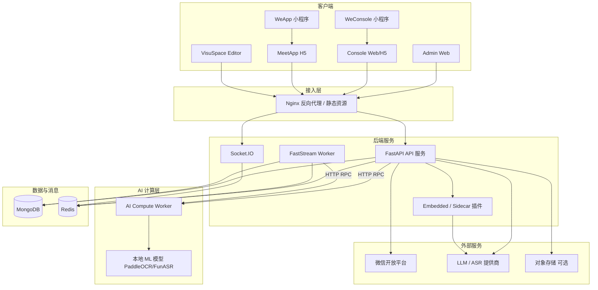

# 系统架构

本文描述星汇小蜜书（MeetEasy）的整体系统拓扑与主要组件职责。内容归纳自 meeteasy 主仓库架构文档，最后更新：2026-06。

## 系统拓扑



## 组件说明

| 组件 | 职责 |
|------|------|
| **Nginx** | TLS 终结、路由到 API 与各前端静态资源、WebSocket 升级 |
| **FastAPI** | REST API、鉴权、租户上下文、业务编排入口 |
| **FastStream Worker** | 异步任务：分析聚合、通知、耗时 IO |
| **Socket.IO** | 实时消息、分析推送、在线状态 |
| **MongoDB** | 主数据：租户、会议、报名、VisuSpace DSL、配置 |
| **Redis** | 缓存、消息队列、Socket.IO adapter |
| **AI Compute Worker** | AI 计算协处理器，加载 OCR、ASR 等本地大模型以进行重算力离线推理 |
| **插件** | 事件驱动扩展 AI、OCR、报名等能力 |

## 分层架构（后端）

```
routers/     → HTTP 入口、参数校验、鉴权依赖
services/    → 业务编排、租户边界、事件发布
crud/        → 数据访问封装
models/      → Beanie Document 与 Pydantic Schema
dependencies/→ DB、Tenant、Auth 注入
plugins/     → 插件注册与钩子
```

原则：**瘦路由、胖服务**；`tenant_id` 来自可信鉴权上下文，不信任客户端 body。

## 前端 Monorepo

```
src/frontend/
├── admin/      # 平台 Admin
├── console/    # 组织者 Console
├── meetapp/    # 参会者 H5
├── visuspace/  # 微站编辑器
├── weapp/      # 参会者小程序壳
├── weconsole/  # 组织者小程序壳
└── webapi/     # 共享 API SDK
```

页面层禁止直连 HTTP 客户端，统一经 webapi 调用。

## 混合架构：小程序 + H5

WeApp / WeConsole 为 **原生壳 + WebView H5**：

- 壳负责微信登录、Login Ticket SSO、分享/扫码等原生能力
- 业务页面在 MeetApp/Console H5 中高频迭代
- 详见 [Login Ticket SSO](/user-manual/wechat/sso)

## 多租户

- 所有业务数据携带 `tenant_id` 作用域
- Admin 跨租户操作需独立超级管理员权限
- 数据库索引与查询默认 tenant 过滤

## 异步与分析

- 分析事件经 SDK 批量上报 → Redis 队列 → Worker 聚合
- 详见 [分析与异步](/developer/analytics-async)

## 相关文档

- [后端概览](/developer/backend/)
- [前端概览](/developer/frontend/)
- [部署运维](/developer/deployment)
- [架构原则（产品视角）](/product/principles)
