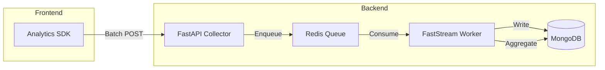

# Analytics & Async Processing

MeetEasy's analytics pipeline collects, batches, and processes event data asynchronously using FastStream and Redis.

## Analytics Architecture



## Event Collection

### Frontend Analytics SDK

A shared analytics SDK in the WebAPI layer collects events across all frontend apps:

```typescript
import { trackEvent } from '@meeteasy/webapi/analytics'

trackEvent('page_view', {
  conference_id: 'abc123',
  page: '/agenda',
  referrer: document.referrer,
})
```

### Event Types

| Event | Trigger | Data |
|-------|---------|------|
| `page_view` | Page load / navigation | URL, conference ID, referrer |
| `share` | User shares a link | Share code, channel, target URL |
| `share_open` | Recipient opens shared link | Share code, attribution chain |
| `registration` | Registration submitted | Conference ID, form ID |
| `checkin` | Attendee checked in | Conference ID, method |
| `ai_chat` | AI message sent | Conference ID, message length |

### Batch Upload

Events are not sent individually. The SDK batches them:

1. Events collected in an in-memory queue
2. Upload triggered by:
   - **Time window** — Every N seconds (e.g., 30s)
   - **Queue threshold** — When N events accumulated (e.g., 20)
3. Batch POST to `/api/analytics/events`

This reduces network overhead and improves performance on mobile.

## Share Attribution

Share tracking uses URL parameters to build attribution chains:

### Flow

1. User A shares a conference link → SDK generates `share_code_A`
2. Link format: `https://m-app.xinghui.club/conf/abc?_s=share_code_A`
3. User B opens the link → SDK records `share_open` with `share_code_A`
4. User B shares to User C → SDK generates `share_code_B` linked to `share_code_A`
5. User C registers → conversion attributed to both A and B

### Attribution Tree

```
User A (original sharer)
  └── User B (opened A's link, then shared)
       └── User C (opened B's link, registered) ← conversion
```

Organizers view this tree in Console Analytics → Share Tracking.

## Async Processing (FastStream)

### Worker Architecture

The FastStream worker consumes tasks from Redis queues:

| Queue | Task | Description |
|-------|------|-------------|
| `analytics.events` | Process event batch | Write events to MongoDB |
| `analytics.daily` | Daily aggregation | Compute PV/UV/registrations per day |
| `notifications.email` | Send email | Registration confirmation, approval |
| `notifications.sms` | Send SMS | Check-in reminders |
| `files.convert` | File conversion | Office → PDF, image processing |
| `ai.generate` | AI generation | VisuSpace page generation |

### Running the Worker

```bash
cd src/backend
faststream run meeteasy.worker:app
```

In production, run as a systemd service (see [Deployment](./deployment)).

### Idempotency

All worker tasks are designed for safe retry:

- Analytics events use event ID deduplication
- Notifications check send status before retrying
- File conversion checks output existence

## Real-time Updates (Socket.IO)

Socket.IO complements the async pipeline for live updates:

- **Check-in notifications** — Organizer dashboard updates in real time
- **Registration alerts** — New registration notifications
- **Analytics streaming** — Live PV counter (optional)

Socket.IO uses Redis adapter for multi-instance scaling.

## Daily Aggregation

A scheduled worker task computes daily summaries:

```json
{
  "date": "2026-06-20",
  "conference_id": "abc123",
  "pv": 1523,
  "uv": 892,
  "registrations": 45,
  "checkins": 12,
  "shares": 67,
  "share_conversions": 8
}
```

Summaries are stored in MongoDB and served via the analytics API.

## Developer Integration

### Adding a New Event Type

1. Define event schema in backend models
2. Add tracking function in WebAPI analytics SDK
3. Call from the relevant frontend component
4. Add worker handler if post-processing needed
5. Update analytics dashboard queries

### Testing

```bash
# Send test events
curl -X POST http://localhost:8000/api/analytics/events \
  -H "Content-Type: application/json" \
  -d '{"events": [{"type": "page_view", "conference_id": "test", "page": "/"}]}'

# Check worker processing
# Watch worker logs for event processing confirmation
```

## Performance Considerations

- Batch upload reduces HTTP requests by 10–50x vs individual events
- Worker horizontal scaling via multiple FastStream instances
- MongoDB indexes on `conference_id + date` for fast aggregation queries
- Redis queue backpressure prevents worker overload
