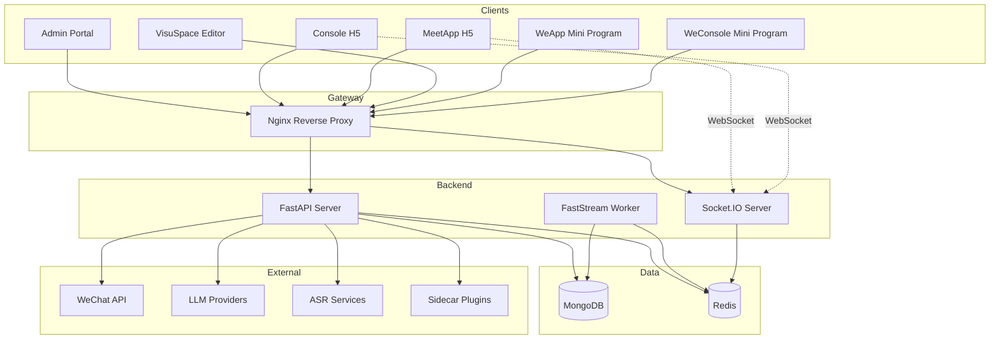

# System Architecture

This page describes MeetEasy's system topology, component interactions, and architectural patterns.

## System Topology



## Components

### Frontend Applications

| App | Path | Role |
|-----|------|------|
| Admin | `src/frontend/admin` | Platform operator portal (Ant Design Vue) |
| Console | `src/frontend/console` | Organizer mobile H5 (Vant UI) |
| MeetApp | `src/frontend/meetapp` | Attendee mobile H5 (Vant UI) |
| VisuSpace | `src/frontend/visuspace` | Visual page builder |
| WeApp | `src/frontend/weapp` | WeChat attendee mini program (UniApp) |
| WeConsole | `src/frontend/weconsole` | WeChat organizer mini program (UniApp) |
| WebAPI | `src/frontend/webapi` | Shared TypeScript API SDK |

All frontends consume the backend via the WebAPI SDK — pages never call HTTP clients directly.

### Backend Services

| Service | Path | Role |
|---------|------|------|
| API Server | `src/backend/meeteasy` | FastAPI HTTP + Socket.IO endpoints |
| Worker | `src/backend/meeteasy` (FastStream) | Async background task processing |
| Plugins | `src/backend/meeteasy/plugins` | Embedded and Sidecar plugin runtime |

### Backend Layering

```
routers/        → HTTP route declarations, param validation, auth deps
services/       → Business logic, orchestration, permission checks
crud/           → Database operations (Beanie queries)
models/         → Beanie Documents + Pydantic schemas
dependencies/   → Auth, tenant context, DB connection injection
plugins/        → Plugin registry, event hooks, Sidecar proxy
```

**Thin Router, Rich Service:** Routers handle protocol only. All business logic lives in services.

### Data Stores

- **MongoDB** — Primary document store (conferences, users, registrations, analytics events, VisuSpace pages)
- **Redis** — Message queue (FastStream), caching, Socket.IO adapter, session storage

### External Integrations

- **WeChat** — Mini program login, OAuth, share APIs
- **LLM providers** — AI chat (configurable per tenant via plugins)
- **ASR services** — Speech recognition for voice input
- **Sidecar plugins** — External HTTP services for custom integrations

## Multi-Tenancy

Every data operation is scoped to a tenant:

1. User authenticates → JWT contains `tenant_id`
2. Dependency injection extracts `tenant_id` from trusted token context
3. All CRUD queries include `tenant_id` filter
4. Cross-tenant access requires explicit super-admin permission

Client-supplied `tenant_id` in request bodies is never trusted as the sole source.

## Real-time Communication

Socket.IO provides bidirectional communication for:

- Live notifications to attendees (session reminders, announcements)
- Real-time check-in status updates for organizers
- Analytics event streaming

The Socket.IO server shares Redis adapter for horizontal scaling.

## Async Processing

Long-running and CPU-intensive tasks are offloaded to FastStream workers via Redis:

- Analytics event batch processing
- File conversion (Office → PDF, OCR)
- Email/SMS notification dispatch
- AI generation tasks (VisuSpace page generation)

See [Analytics & Async Processing](./analytics-async) for details.

## WeChat Hybrid Architecture

Mini programs use a **native shell + H5 WebView** pattern:

- Native layer: WeChat login, share, scan, app lifecycle
- H5 layer: All business UI and logic (MeetApp / Console)
- SSO: Login Ticket exchange for seamless auth

See [Login Ticket SSO](/en/user-manual/wechat/sso) for the authentication flow.

## API Design

- **REST** for CRUD and business operations
- **Socket.IO** for real-time events
- **Versioning** via new route prefixes for breaking changes
- **Error codes** with i18n message keys (no hardcoded strings)
- **Pagination** via `page`/`page_size` or `skip`/`limit`

## Security

- All auth/permission checks on the backend
- Frontend permission UI is cosmetic only
- Sensitive data masked in logs
- HTTPS/TLS for all production traffic
- Login tickets are single-use with short TTL

See [Data Security Policy](/en/legal/data-security) for compliance details.
