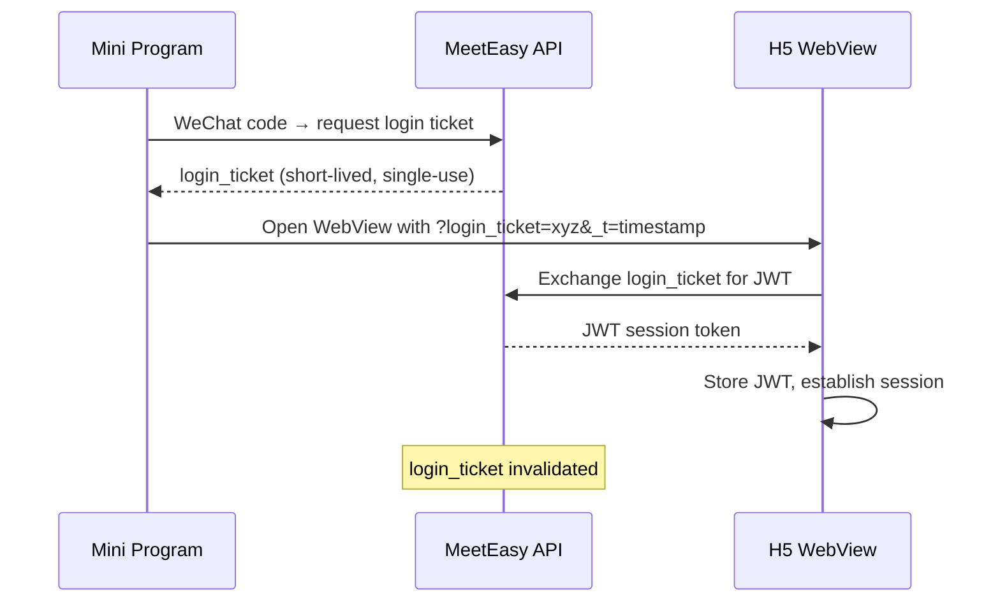

# Login Ticket SSO

MeetEasy uses a **Login Ticket** single sign-on flow to authenticate users seamlessly between WeChat mini programs and embedded H5 pages.

## Why Login Ticket SSO?

WeChat mini programs and H5 pages run in different contexts with separate cookie/storage domains. Direct cookie sharing is not possible. Login Ticket SSO bridges this gap with a secure, one-time token exchange.

## Flow Overview



## Step-by-Step

### 1. Mini Program Authentication

The mini program (WeApp or WeConsole) uses WeChat's native login:

1. User opens the mini program.
2. Mini program calls `wx.login()` to obtain a WeChat authorization code.
3. Mini program sends the code to MeetEasy API: `POST /auth/wechat/login`.
4. API validates the code, identifies the user, and returns a **login_ticket**.

### 2. WebView Launch

The mini program opens the H5 page in a WebView with the ticket as a URL parameter:

```
https://m-app.xinghui.club/conference/abc123?login_ticket=TICKET_VALUE&_t=1700000000
```

| Parameter | Purpose |
|-----------|---------|
| `login_ticket` | One-time authentication token |
| `_t` | Timestamp to prevent WebView caching of stale URLs |

### 3. Ticket Exchange

When the H5 page loads:

1. H5 detects `login_ticket` in the URL query string.
2. H5 calls API: `POST /auth/login-ticket/exchange` with the ticket.
3. API validates the ticket (exists, not expired, not used).
4. API returns a **JWT session token**.
5. H5 stores the JWT in local storage and removes the ticket from the URL.

### 4. Session Established

The H5 application now operates with a full authenticated session — identical to a browser login.

## Security Constraints

| Rule | Rationale |
|------|-----------|
| **Single-use** | Ticket is invalidated immediately after exchange |
| **Short TTL** | Ticket expires within minutes if unused |
| **No replay** | Used tickets are rejected; prevents replay attacks |
| **Timestamp parameter** | `_t` prevents WebView from serving cached pages with stale tickets |
| **HTTPS only** | All ticket exchange over TLS |

## Error Handling

| Scenario | Behavior |
|----------|----------|
| Ticket expired | H5 shows login prompt; mini program re-authenticates |
| Ticket already used | H5 shows login prompt |
| Invalid ticket | API returns 401; H5 redirects to login |
| WebView cache | `_t` timestamp ensures fresh page load |

## H5 Fallback (Non-WeChat)

When users access MeetApp or Console directly in a browser (not via mini program):

- Standard email/phone + password login applies
- No login ticket involved
- JWT session managed via normal auth flow

## Developer Reference

For API endpoint details and implementation, see the [Developer Architecture Guide](/en/developer/architecture).

## Tips for Organizers

- SSO is automatic — no configuration needed beyond WeChat AppID setup in Admin
- If attendees report login issues in WeChat, ask them to close and reopen the mini program
- Ensure WeChat mini program credentials in Admin match the registered apps in WeChat Open Platform
