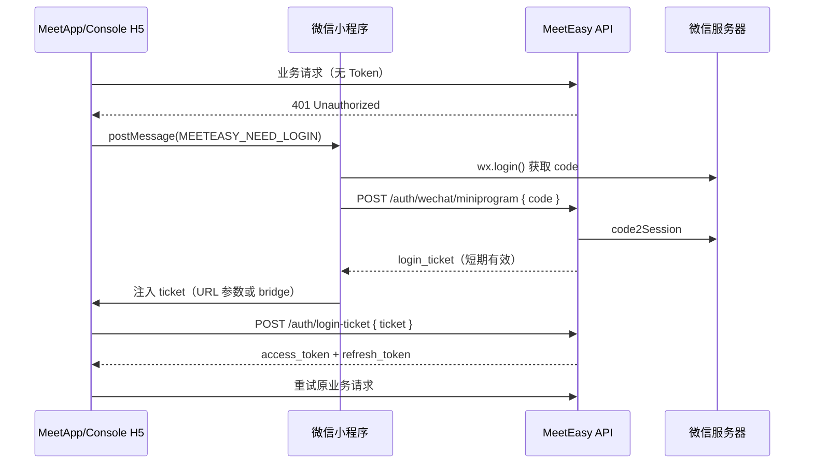

# Login Ticket SSO 流程

在微信小程序 WebView 中加载 MeetApp/Console H5 时，会话过期或首次访问需通过 **Login Ticket SSO** 完成静默或半静默登录。

## 场景

1. 用户在小程序 WebView 打开 H5 页面。
2. H5 请求 API 返回 **401 Unauthorized**（无有效 Token）。
3. H5 通过 `postMessage` 通知小程序需要登录。
4. 小程序调用微信登录 → 后端换取 **Login Ticket** → 回传 H5 完成 Token 交换。

## 流程图

## 关键概念

| 术语 | 说明 |
|------|------|
| Login Ticket | 一次性、短时效票据，用于 H5 换取 JWT/Session Token |
| code | 微信 `wx.login` 返回，后端换 openid/session_key |
| postMessage | WebView 与小程序通信桥梁，仅特定时机可触发 |

## 安全要点

- Login Ticket **单次使用、短过期**（通常 ≤ 5 分钟）。
- Ticket 与微信 openid、小程序 AppID 绑定，不可跨小程序复用。
- H5 仅在 HTTPS 域名下运行；Token 存储遵循 webapi SDK 策略（httpOnly Cookie 或 secure storage）。

## 组织者 vs 参会者

| 小程序 | 后端 auth 路由 | H5 应用 |
|--------|----------------|---------|
| WeApp | 参会者微信身份 | MeetApp |
| WeConsole | 组织者微信身份（需绑定 Console 账号） | Console |

组织者首次使用可能需 **绑定已有 Console 账号**（手机号验证），具体 UI 以产品为准。

## 调试建议

1. 微信开发者工具打开小程序 + 真机调试 WebView。
2. 后端日志查看 `/auth/wechat/miniprogram` 与 `/auth/login-ticket`。
3. 确认业务域名、TLS 证书、AppID 与后端 `.env` 一致。

## 相关文档

- [微信小程序概述](/user-manual/wechat/)
- [后端概览](/developer/backend/) — auth 命名空间
